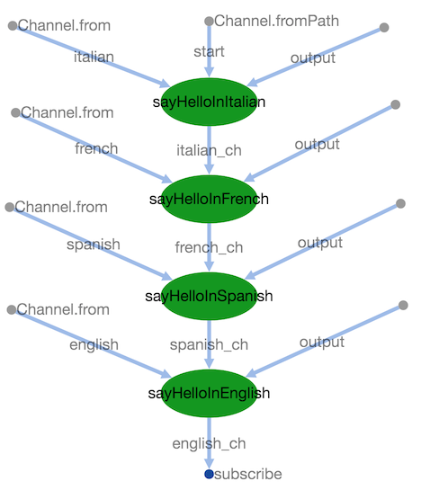

Hello World Pipeline
====================
[](https://www.nextflow.io/)

A modified version of the original [hello world](https://github.com/nextflow-io/hello) script from [nextflow-io](https://www.nextflow.io/).

We test templates, passing files across processes, docker, local/cluster executions.

# Description
4 processes, each of them appends a line (in a different language) to a file consumed by the next process.
At the end of the execution, the content of the final file is shown.

# Execution
Clone the project and run:

    nextflow run main.nf -profile [local|cluster] 

or with [pipeline sharing](https://www.nextflow.io/docs/latest/en/latest/sharing.html), just run:
    
    nextflow run manuelesimi/hello-nextflow 
    
# Output
    
``` bash
$ nextflow run manuelesimi/hello-nextflow

N E X T F L O W  ~  version 20.01.0
Pulling manuelesimi/hello-nextflow ...
downloaded from https://github.com/manuelesimi/hello-nextflow.git
Launching `manuelesimi/hello-nextflow` [romantic_roentgen] - revision: ec3621d2c9 [master]
executor >  local (4)
[ce/b6e6c2] process > sayHelloInItalian [100%] 1 of 1 ✔
[6e/0a170c] process > sayHelloInFrench  [100%] 1 of 1 ✔
[55/b05258] process > sayHelloInSpanish [100%] 1 of 1 ✔
[f9/650a7c] process > sayHelloInEnglish [100%] 1 of 1 ✔
Nextflow says:
--- Welcome ---
Ciao world!
Bonjour world!
Hola world!
Hello world!
```    
## DAG visualization


## References
* https://www.nextflow.io/
* https://github.com/nextflow-io/hello